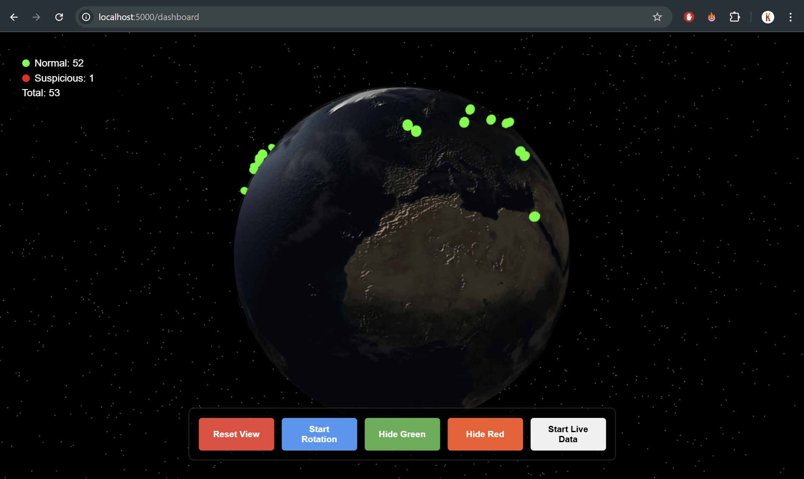

# This is the 2nd assignment for DWV course.

## How to run
Run docker-compose
```bash
docker-compose build
docker-compose up
```

The dashboard is accessible by link: http://localhost:5000/dashboard

## The UI example:


## UI description:
### Buttons
You need to push button `Start Live Data` and wait for 5 seconds to see points on a globe. The data will be updated every 5 seconds. If you need to fix datapoints as is you press the button `Stop Live Data`.

Button `Reset View` reset the globe position.
Button `Stop Rotation` stops the globe rotation.
Also there are 2 buttton to show/hide points on a globe.
## Statistics and info
In the upper left corner you can see simple statistics, how many points for each category are drown.
Focusing on a particular point shows the information about the point.
